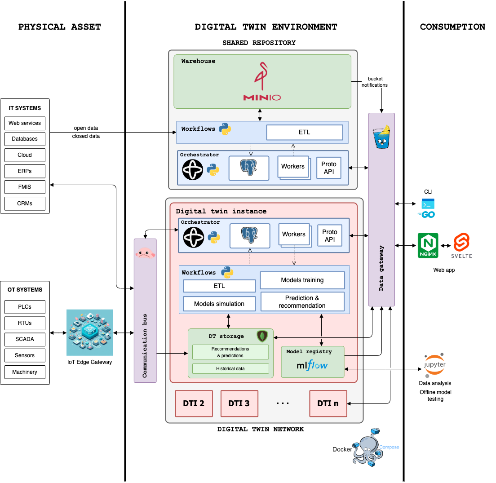

# Digital Twin for agrarian exploitations

## What is a Digital Twin?

A digital twin is a virtual representation of an object or system designed to reflect a physical object accurately. It spans the object's lifecycle, is updated from real-time data and uses simulation, machine learning and reasoning to help make decisions. (<https://www.ibm.com/topics/what-is-a-digital-twin>)

## What is this project about?

In this project, we are going to create a digital twin for agricultural exploitations, especifically for nuts. We are going to use the following technologies:

- [Docker](https://docs.docker.com/get-docker/)
- [Temporal](https://docs.temporal.io/)
- [MongoDB](https://www.mongodb.com/)
- [Gin](https://github.com/gin-gonic/gin)
- [PostgreSQL](https://www.postgresql.org/)
- [Minio](https://min.io/)
- [Benthos](https://github.com/benthosdev/benthos)
- [Mlflow](https://mlflow.org/)
- [Sveltekit](https://svelte.dev/)
- [Nginx](https://nginx.org/)

## Architecture

The architecture of the project is the following:



## Deployment

### Local deployment

In order to execute the project locally, you need to have installed the following tools:

- [Docker](https://docs.docker.com/get-docker/)
- [Docker Compose](https://docs.docker.com/compose/install/)
- [Visual Studio Code](https://code.visualstudio.com/download) for the sake of simplicity

Actually it has been tested in MacOS, but it should work in Linux and Windows as well. It make use of the [Remote Containers](https://marketplace.visualstudio.com/items?itemName=ms-vscode-remote.remote-containers) extension for Visual Studio Code, so you need to install it as well. The Docker option `Dev Environments (BETA)` is used to create the development environment. It takes the `docker-compose.yml` file and creates the containers. The `devcontainer.json` file is used to configure the development environment. If you want to develop inside a container, through the dev environment, you have an option to attach to an existing container and it uses de `devcontainer` option in Visual Studio code. In this case, no deppendencies need to be installed globally, but in the container.

To execute it if not using the dev environment, you need to execute the following command:

```bash
docker-compose up --build -p digital-twin-local
```

#### golang cli

This applies to all types of deployments. A golang bash cli is provided to execute some actions. To execute it you need to execute the following command:

```bash
./project-cli.sh
```

### Development deployment

To execute it you need to execute the following command:

```bash
docker-compose -f docker-compose.dev.yml -p digital-twin-dev --env-file .env.dev up --build
```

### Production deployment

To execute it you need to execute the following command:

```bash
docker-compose -f docker-compose.prod.yml -p digital-twin-prod --env-file .env.prod up --build
```

## Secrets

Secrets, for the moment, are stored in its respective env file (`.env`, `.env.dev`, `.env.prod`), but it is not a good practice. It is better to store them in a secret manager, like [Vault](https://www.vaultproject.io/). In the future, it will be implemented. This files are injected to its respective container through the `docker-compose.yml` files.

## Guide for example project

### Before starting

- Start docker compose
- Add images to minio
- Temporal file organization

To organize temporal workflows, we have decided to make a folder for each digital twin. Inside each folder, we have the following structure:

```bash
.
├── 47-124-0-0-1-53-1
│   ├── common
│   ├── etl
│   ├── ml-training
│   ├── prediction
│   └── simulations
├── 47-96-0-0-5-20-1
│   ├── common
│   ├── etl
│   ├── ml-training
│   ├── prediction
│   └── simulations
└── open-data
    ├── common
    ├── daily-weather
    ├── forecast-weather
    ├── historical-weather
    └── ndvi
```

We need to create MongoDB replica set to use MongoDB Change Streams, in order to use that database as a real-time event dispatcher. We create a mongo keyfile to use the replicaSet (<https://www.mongodb.com/docs/manual/tutorial/enforce-keyfile-access-control-in-existing-replica-set/>):

```bash
openssl rand -base64 756 > storage/mongodb/mongo-keyfile.key
chmod 400 storage/mongodb/mongo-keyfile.key
```

And then, once we have done the `docker compose up --build` and the MongoDB instance is running, we make it a replica set with one replica only. For that, we create a bash script file with the following information:

```bash
#!/bin/bash
mongosh -u "$MONGO_INITDB_ROOT_USERNAME" -p "$MONGO_INITDB_ROOT_PASSWORD" <<EOF
rs.initiate(
  {
    _id: "rs0",
    members: [{ _id: 0, host: "mongo:27017" }],
  },
  { force: true }
);
rs.status();
EOF
```

Here, we authenticate to the mongo shell and initiate a new mongo replica. To execute it, we simple execute the script inside de mongo container:

```bash
docker exec -it temporal-mongo-1 /data/init_rs.sh
```

Now, in order to have a user to navigate the web app, we need to create one. We created some REST endpoints for the user management in gin-gonic, inside the api-gateway. And to make it easier, a golang client is provided to execute in the terminal. We need an email, password and the roll of the user. To test the user freely, we set role to admin. The cli can be executed with the `project-cli.sh`.

```bash
./project-cli.sh u c --email <email> --password <password> --role admin
```

Each folder corresponds to a digital twin and the open data etl is a folder for the open data etl workflows. As open data is common to all digital twins, it is in a separate folder. It includes weather, ndvi, satellyte image processing workflows, etc. Inside each digital twin folder we have the etl workflows of close data, including holding activities, crop status, statistics like harvest, production or static information regarding the holding.

This is for a local non-production use, where these workflows may not be in the host machine, they can be made in other local machines and then register both workflows and workers in the Temporal server. In this case, we are going to use the Temporal CLI to register the workflows and workers. In Temporal, a feature called namespaces exists, and we are using it to separate the workflows and workers of each digital twin. The namespace is the same as the digital twin identifier.

We are going to register a namespace for the open data processing:

```bash
docker exec -it temporal temporal operator namespace create --namespace open-data --address temporal:7233
```

To register the workflows, we need to run the workers, which are registered in the corresponding namespace. Right now, there is no authentication or security, but, in a production environment, every namespace should be protected and temporal has JWT authentication and claimers regarding the namespace. The following script is to register the workers and each one is an independent process (`temporal/entrypoint.sh`). We created a docker container in which we allocated some resources to run the workers. The following script is to run the workers for each digital twin and it should be executed in the temporal-worker container:

```bash
# open-data
python3 /etc/temporal/workflows/open-data/daily-weather/init_workers.py &
python3 /etc/temporal/workflows/open-data/forecast-weather/init_workers.py &
python3 /etc/temporal/workflows/open-data/historical-weather/init_workers.py &
python3 /etc/temporal/workflows/open-data/ndvi/init_workers.py &
python3 /etc/temporal/workflows/open-data/digital-twin-notifications/init_workers.py &
# 47-96-0-0-5-25-1
python3 /etc/temporal/workflows/47-96-0-0-5-25-1/etl/static-info/init_workers.py &
python3 /etc/temporal/workflows/47-96-0-0-5-25-1/etl/activities/init_workers.py &
# 47-96-0-0-5-20-1
python3 /etc/temporal/workflows/47-96-0-0-5-20-1/etl/static-info/init_workers.py &
python3 /etc/temporal/workflows/47-96-0-0-5-20-1/etl/activities/init_workers.py &
python3 /etc/temporal/workflows/47-96-0-0-5-20-1/prediction/init_workers.py &
python3 /etc/temporal/workflows/47-96-0-0-5-20-1/simulations/init_workers.py &

tail -f /dev/null
```

In the script above, we have registered all the workers that we are going to be using. Open data workflows are for common and open data management and the others correspond to the two digital twins we are using. There are infinite possibilities as every worker associated with the worflows are different.

To ensure that all websockets work, at least in my case, is to stop the nginx server of the computer if it is running.

```bash
sudo nginx -s stop
```

### Login

With the user we have created, we can login at `http://localhost:3000/login`. A JWT token is returned and will be used to keep the user logged in for a while.

### Create two new digital twins

>**IMPORTANT**: You need to create the workflow for ingesting static digital twin information and register the corresponding workflow. In this case, the workflow is under `temporal/workflows/<digital_twin_id>/etl/static-info`.

Once we made login, we need to create some digital twins. We are going to create two, in order to see the interaction between them two. Digital twins are basic **GeoJSON objects**.


We press the button to create a new digital twin. After that, we fill the form with a new GeoJSON object. If the object is correct, a polygon on the right map will appear. We are going to create the two digital twins.


Then, we will be redirected to the map page, where we will see the created digital twins. In this page, we can filter and sort the digital twins based on its properties. If it doesn't load, reload the page.


We can visit the monitoring and the analysis page to see that they are still empty:


However, daily and forecast weather information is already available because, when the digital twin is created, a meteorological station id is added to the properties. It is used every day in a Temporal workflow to do a ETL process to recover the information in real time.


Now, we are going to add some more information to the digital twins, including ndvi, weather and activities that affect the holdings.

### Schedule data ingestion and execute it on demand

Let's create a schedule to ingest ndvi and historical weather data every Sunday at 00:00. We can do it through the CLI or the UI. This will take every digital twin in the platform and execute the ingestion for each one of them. The following images are from the UI:


The following temporal CLI commands are the equivalent to the UI actions:

```bash
docker exec -it temporal temporal schedule create \
    --namespace 'open-data' \
    --schedule-id 'schedule-id-historical-weather-scheduled-workflow' \
    --cron '0 0 * * SUN' \
    --workflow-id 'historical-weather-scheduled-workflow' \
    --task-queue 'historical-weather-task-queue' \
    --type 'HistoricalWeatherScheduleWorkflow' \
    --address temporal:7233
```

```bash
docker exec -it temporal temporal schedule create \
    --namespace 'open-data' \
    --schedule-id 'schedule-id-ndvi-scheduled-workflow' \
    --cron '0 0 * * SUN' \
    --workflow-id 'ndvi-scheduled-workflow' \
    --task-queue 'ndvi-task-queue' \
    --type 'NDVIScheduledWorkflow' \
    --address temporal:7233
```


Now that the schedules are created, we can execute them on demand. We are going to execute it now in order to see all the historical data.
In this case, ndvi endpoint is slow and it is going to take a while, several minutes, up to 30 minutes.

```bash
docker exec -it temporal temporal schedule trigger --namespace open-data --schedule-id 'schedule-id-historical-weather-scheduled-workflow' --address temporal:7233
docker exec -it temporal temporal schedule trigger --namespace open-data --schedule-id 'schedule-id-ndvi-scheduled-workflow' --address temporal:7233
```

Or we can trigger it using the UI:


We need to wait some minutes for them to execute in the background. After that, we can see the information in the app:


### Add files to ingest

Now, to complete the context of the holding, we are going to add some activities of the digital twins and information about the harvest. Information, as it can be in real life, is diverse and heterogeneous. In the last case, ndvi and historical weather data are ingested from a REST API. This information is contained in Excel and JSON files. We are going to add them to the platform.

To do that, we are going to use the file form in the Monitoring page to upload them:


In this case, we have several example files to upload under `example-data` folder. We are going to ingest files of `47-96-0-0-5-20-1` in this guide. Files are `FakeHarvest-1.json` and `FakeActivities-1.xlsx`. First one contains yield information historic and second one contains activities historic of the digital twin.


Now that files are processed using temporal workflows, [Minio Events](https://min.io/docs/minio/linux/administration/monitoring/publish-events-to-webhook.html) and gin-gonic webhooks to receive the events, information is in the digital twin database.

The minio events must be configured and, in this case, are configured in the `storage/minio/entrypoint.sh` file.

```bash
# Set an alias for mc client
mc alias set minio $MINIO_URL $MINIO_ROOT_USER $MINIO_ROOT_PASSWORD
echo "adding event notifications"
# Add temporal webhook notification when a json, csv or xlsx file is uploaded to these buckets
mc event add minio/landing-zone arn:minio:sqs::landing:webhook --event put
mc event add minio/trusted-zone arn:minio:sqs::trusted:webhook --event put
mc event add minio/refined-zone arn:minio:sqs::refined:webhook --event put
```

We can see they are active in the Minio UI (<http://localhost:9001>) as `online`.


We can see that there are three stages in the ETL process. First, the files are stored in the landing zone and the landing event is dispatched. The gin-gonic webhook receives the event and it executes the temporal workflow, where it will be processed and stored in the trusted zone. Finally, another temporal workflow is executed, where it will be convert to the corresponding digital twin domain and stored in the digital twin database, in MongoDB. The refined zone is the last bucket where the information is for third party use (not implemented yet).

### Show pages with new data

Now, Analysis page is showing the activities information of that digital twin as verticals bars, where the event is taken place.


Moreover, in the Monitoring page, we can see the production and yield over the time, and our digital twin is ready to build a machine learning model in order to predict the yield.


### Add a streaming source and connect with frontend

Of course, the digital twin is fed also with sensor stream data. As we do not have a real holding with sensors, we can use a mqtt public endpoint to recover some random information to show. We will do it with Benthos and it is fairly easy. We need to create a config.yaml and create and input, processor and output.

We are going to ingest the raw data from the mqtt server, process them in parallel using multiple CPUs to filter only numbers between 22 and 25 (just for testing purposes), and write them in batches of 200 into mongodb to be as efficient as possible or saving the available data every 1 minute.

```yaml
# https://www.youtube.com/watch?v=EA2Pco3EvpU

input:
  label: "mqtt_test"
  mqtt:
    urls: ["test.mosquitto.org:1883"]
    topics: ["#"]
    client_id: ""
    connect_timeout: 30s
    auto_replay_nacks: false # if false, rejected messages are deleted, improving back pressure
    qos: 0

pipeline:
  threads: 4
  processors:
    # Filter numbers
    - label: "filter"
      bloblang: |
        root = if this.number().catch(null) != null && this.number() < 25 && this.number() > 22 {
          this
        } else {
          deleted()
        }
output:
  label: "mongodb_output"
  mongodb:
    url: "${MONGO_URI}" # No default (required)
    database: "47-96-0-0-5-20-1" # No default (required)
    collection: "Sensors" # No default (required)
    operation: insert-one
    write_concern:
      w: majority
      j: false
      # w_timeout: 5000s
    document_map: |
      root.type = "temperature"
      root.value = this
      root.unit = "C"
      root.timestamp = now()
    max_in_flight: 2
    batching:
      count: 500
      period: "1m"

```

Now, data is being added in real time to MongoDB, in the database of the corresponding digital twin. Now, to read that information in real-time, we are going to combine [MongoDB Change Streams](https://www.mongodb.com/docs/manual/changeStreams/) and [SSE Events](https://go-gin.onrender.com/room/hn). In a gin REST endpoint, inside `api-gateway/gin-gonic`, we can create a real time endpoint to read the data from the frontend in the Monitoring page. Bellow is the UI component that shows the data, in this case, the temperature.


### Detect a flooding in a digital twin and send notifications

Now, to test the digital twins communication, we are going to fake some notifications. We are going to leverage the mqtt server to do it. In this case, when "rain" is between 60 and 65 mm, we are going to execute a temporal workflow that will process that value and tell if the quantity is worth the warning to near digital twins.

We are using benthos again, to get the sensor data and to make a first and fast filter to get only plausible risk values. The code is shown below:

```yaml
# https://www.youtube.com/watch?v=EA2Pco3EvpU

input:
  label: "mqtt_test"
  mqtt:
    urls: ["test.mosquitto.org:1883"]
    topics: ["#"]
    client_id: ""
    connect_timeout: 30s
    auto_replay_nacks: false # if false, rejected messages are deleted, improving back pressure
    qos: 0

pipeline:
  threads: 4
  processors:
    # Filter numbers
    - label: "filter"
      bloblang: |
        root = if this.number().catch(null) != null && this.number() > 61.5 && this.number() < 62 {
          this
        } else {
          deleted()
        }
    - label: build_body
      mapping: |
        root.type = "water"
        root.value = this.number()
        root.timestamp = now()
        root.digitalTwinId = "47-96-0-0-5-20-1"

output:
  label: gin_webhook
  http_client:
    url: "http://gin-gonic:8080/temporal-webhook/notifications"
    verb: POST
    headers: {}
    timeout: 10s
    max_in_flight: 64
    batching:
      count: 1
    # auto_replay_nacks: false
    retries: 0
```

As we see, to not overflow the system, we get only values between 61.5 and 62. Then, it is mapped to the body of the POST request and sent to a gin-gonic webhook, were the temporal workflow is executed.

If we go to <localhost:8085/namespaces/open-data/workflows>, we can see all the executed notification workflows in the Temporal server. The following image shows the completed workflows.


If we click on the first one, we can see the inner information of the workflow. For instance, we have the event history, in which we have the result of each stage. In this case, first the danger is evaluated, second we get the nearest digital twin ids and finally, we save the notification in the `common` database for each digital twin.

If the danger is evaluated as serious, it also sends feedback to the physical asset automatically. In this case, as we do not have any physical asset, we have nothing to do. But the natural behavior is to send the command to Benthos and it will transform it to the endpoint of the physical asset (SCADA, API, Kafka, etc). Bellow we have two event history cases where the notification importance is serious and mid.


As we said, if it is serious, the workflow sends a message to a REST Api in Benthos and it will redirect it to the physical asset. In this case, as example, we log the value and the type of the notification in the Benthos stdout. In this case, we send a feedback to stop the irrigation system for 12 hours.


Then, as the notification is saved in MongoDB, from the frontend, we can use SSE events to read it in real time, using gin-gonic and MongoDB Change Streams. Here we have a ./docs/images/screenshot when the notification is showed in the top left.


Notifications and commands can be found in the Activities page, where commands are differentiated as automatic (system-initiated) or manual (user-initiated) commands, with status tracking. In this page, there are also the activity data, such as yield, prunes or irrigation time.


### Build a predictive model and register it

First, we need to test the model offline using the digital twin data we have. We are going to use a Jupyter notebook to test it. The created notebook is located under `temporal/workflows/47-96-0-0-5-20-1/ml-training/harvest-ai-model.ipynb`. In this case we are going to test it in the digital twin `45-96-0-0-5-20-1`. After we added the activities and yield data to that digital twin database, we can extract it along with the weather data already ingested.

We merge the data and group it by year and impute the missing values just for testing purposes. We are left with this simple tabular data:


Then, we are going to train our model. In this case we are using a Random Forest Regressor that predicts the yield, the day and the month.

```python
# Create a simple model
from sklearn.ensemble import RandomForestRegressor
from sklearn.model_selection import train_test_split
from sklearn.metrics import mean_squared_error
X = data.drop(columns=["yield", "day", "month", "year", "date"])
y = data[["yield", "day", "month"]]
X_train, X_test, y_train, y_test = train_test_split(X, y, test_size=0.1, shuffle=False, random_state=123)
model = RandomForestRegressor(random_state=123)
model.fit(X_train, y_train)
```

Now, we can make a prediction with our test data.

```python
y_pred = model.predict(X_test)
print(f"Predicted vs real yield: {y_pred.ravel()[0]} vs {y_test['yield'].values[0]}")
```

In this case, prediction yield is:

```bash
[[555.32  25.6    9.14]]
Predicted vs real yield: 555.32 vs 595.0
```

We are left with 555.32 the 25th of September, and we did not get a large error with respect to the real yield. Now that we have tested the model, we are going to register it in the model registry of MLflow.

```python
import os
os.environ['MLFLOW_S3_ENDPOINT_URL'] = 'http://localhost:9000'  # Adjust the URL to your MinIO server
os.environ['AWS_ACCESS_KEY_ID'] = 'minio'
os.environ['AWS_SECRET_ACCESS_KEY'] = 'minio123'

# Save in MLflow
import mlflow
mlflow.set_tracking_uri("http://localhost:5000")
mlflow.set_experiment("Yield")
run_id = None
with mlflow.start_run():
    mlflow.autolog()
    from sklearn.ensemble import RandomForestRegressor
    from sklearn.model_selection import train_test_split
    from sklearn.metrics import mean_squared_error
    X = data.drop(columns=["yield", "day", "month", "year", "date"])
    y = data[["yield", "day", "month"]]
    X_train, X_test, y_train, y_test = train_test_split(X, y, test_size=0.1, shuffle=False, random_state=123)
    model = RandomForestRegressor(random_state=123)
    model.fit(X_train, y_train)
    y_pred = model.predict(X_test)
    print(f"Predicted vs real yield: {y_pred.ravel()[0]} vs {y_test['yield'].values[0]}")
    # Plot
    import matplotlib.pyplot as plt
    plt.scatter(y_pred.ravel()[0], y_test['yield'].values[0])
    plt.xlabel("Real yield")
    plt.ylabel("Predicted yield")
    plt.show()
    mlflow.sklearn.log_model(sk_model=model,
                             artifact_path="yield_model",
                             input_example=X_train.head(1),
                             registered_model_name="yield_model_random_forest")
    run_id = mlflow.active_run().info.run_id
run_id
```

Now the model is registered in the model registry and we can see it in the Mlflow web ui in `http://localhost:5000/`:


We are left with the `run_id` that we can use to serve the model. We can serve it using the MLflow server. This is in case we want to use it to simulate predictions:


```bash
MLFLOW_TRACKING_URI=http://mlflow:5000 MLFLOW_S3_ENDPOINT_URL=http://minio:9000 AWS_ACCESS_KEY_ID=minio AWS_SECRET_ACCESS_KEY=minio123  mlflow models serve -m runs:/<run_id>/yield_model -p 5001 -h 0.0.0.0 --no-conda
```

If the following warning is present, it means that some of the versions of python or packages are different from the model saved in the model registry. Try to use the same versions as the compiled model.

```bash
2024/07/23 12:35:36 INFO mlflow.models.flavor_backend_registry: Selected backend for flavor 'python_function'
2024/07/23 12:35:36 INFO mlflow.pyfunc.backend: === Running command 'exec gunicorn --timeout=60 -b 0.0.0.0:5001 -w 1 ${GUNICORN_CMD_ARGS} -- mlflow.pyfunc.scoring_server.wsgi:app'
[2024-07-23 12:35:36 +0000] [112] [INFO] Starting gunicorn 21.2.0
[2024-07-23 12:35:36 +0000] [112] [INFO] Listening at: http://0.0.0.0:5001 (112)
[2024-07-23 12:35:36 +0000] [112] [INFO] Using worker: sync
[2024-07-23 12:35:36 +0000] [113] [INFO] Booting worker with pid: 113
2024/07/23 12:35:38 WARNING mlflow.utils.requirements_utils: Detected one or more mismatches between the model's dependencies and the current Python environment:
 - mlflow (current: 2.10.2, required: mlflow==2.14.3)
 - numpy (current: 1.26.4, required: numpy==1.26.1)
 - packaging (current: 23.2, required: packaging==23.0)
 - psutil (current: uninstalled, required: psutil==5.9.4)
 - scikit-learn (current: 1.5.1, required: scikit-learn==1.3.2)
 - scipy (current: 1.14.0, required: scipy==1.11.3)
To fix the mismatches, call `mlflow.pyfunc.get_model_dependencies(model_uri)` to fetch the model's environment and install dependencies using the resulting environment file.
2024/07/23 12:35:38 WARNING mlflow.pyfunc: The version of Python that the model was saved in, `Python 3.11.5`, differs from the version of Python that is currently running, `Python 3.10.12`, and may be incompatible
/usr/local/lib/python3.10/site-packages/sklearn/base.py:376: InconsistentVersionWarning: Trying to unpickle estimator DecisionTreeRegressor from version 1.3.2 when using version 1.5.1. This might lead to breaking code or invalid results. Use at your own risk. For more info please refer to:
https://scikit-learn.org/stable/model_persistence.html#security-maintainability-limitations
  warnings.warn(
/usr/local/lib/python3.10/site-packages/sklearn/base.py:376: InconsistentVersionWarning: Trying to unpickle estimator RandomForestRegressor from version 1.3.2 when using version 1.5.1. This might lead to breaking code or invalid results. Use at your own risk. For more info please refer to:
https://scikit-learn.org/stable/model_persistence.html#security-maintainability-limitations
  warnings.warn(
```

Once we have registered the model in the model registry, we are going to create a schedule that will trigger the workflow. We are going to schedule the workflow every Saturday at 10:00 am for instance. The workflow takes the last model registered in MLflow and uses it to make predictions.

```bash
docker exec -it temporal temporal schedule create \
    --namespace '47-96-0-0-5-20-1' \
    --schedule-id 'schedule-id-harvest-ai-prediction-workflow' \
    --cron '0 10 * * SAT' \
    --workflow-id 'harvest-ai-prediction-workflow' \
    --task-queue 'harvest-ai-prediction-task-queue' \
    --type 'HarvestAIPredictionWorkflow' \
    --address temporal:7233
```

The schedule can be seen in the temporal UI in the `Schedules` tab in the left.


Now that the schedule is created, we can execute it on demand if we want to see which predictions are going to be made.

```bash
docker exec -it temporal temporal schedule trigger --namespace '47-96-0-0-5-20-1' --schedule-id 'schedule-id-harvest-ai-prediction-workflow' --address temporal:7233
```

This workflow can be monitored and traced from the temporal UI. The next image is the prediction executed from the UI manually, and we can see the stages of the workflow, all green because they were executed correctly.


In each stage, we can click and seen inputs, outputs and errors. In this case, in the `load_prediction` stage we can see the input is an object with the prediction yield and the date and there is no output.


Now, we can see the predictions in the web app, in the Monitoring page. The vertical yellow line is the yield prediction, which marks the best moment to harvest and which will be the yield. In this case, the best moment is the 25th of September and it will give 562.41 kg.


This will be executed, in this case every week, depending on the schedule, and it will be adjusted progressively. Moreover, when the model makes the prediction, it will be **retrained** with the new data ingested, in order to be up to date.

### Build a simulation

We can also build custom simulations in every digital twin using temporalio workflows and leveraging the [temporal signals](https://docs.temporal.io/workflows#dynamic-handler), to update the state of the simulation.

To create a new simulation, we have to go to the Simulations page and select the corresponding digital twin. Then, click the button "New simulation".


Now, we can start the simulation. In this case, to see the simulation state in real time, MongoDB ChangeStreams will also be used. The temporalio workflow will start the simulation and send the data to MongoDB in every step.

We can change the initial conditions of the simulation, the start date, the end date and the number of trees. Then, we can click the run symbol to start the simulation. We can also change the speed of the simulation to be faster or slower.

An example of simulation state is:

```json
    {
 "digitalTwin": {
  "affected_trees": 0,
  "cold_hours": 189,
  "crop_stage": "Growing",
  "dead_trees": 0,
  "end_date": "2021-12-31",
  "harvest": null,
  "id": "47-96-0-0-5-20-1",
  "name": "Digital Twin Pistachio",
  "num_trees": 100,
  "prec_accumulated": 9830.478154607117,
  "start_date": "2021-01-01",
  "sun_hours": 67,
  "time_elapsed": 648
 },
 "plagues": [],
 "simulationId": "97a9f6d4-2064-4f86-a50a-322ee5362782",
 "time": {
  "day": 28,
  "hour": 0,
  "hour_duration": 0.25,
  "month": 1,
  "year": 2021
 },
 "weather": {
  "humidity": 10.359693311103229,
  "precipitation": 6.872413354683924,
  "sky_state": "C",
  "temperature": 5.79424885553777,
  "wind_direction": "S",
  "wind_speed": 39.40391806960296
 }
}
 ```

For the moment, it is show as a json object.

Once the simulation progresses, it will be showing some results, including alive trees, affected ones and yield. Yield will be plotted in a bar chart as an example. The pie chart is another example of a possible metric. We can also see an image of some trees which is another example of a future 2D map of the digital twin in the simulation.


After some simulations, we can see the list of simulations that have been or are running. Simulations will be running in the background if we do not pause or stop them.


Temporal workflows can be seen in its UI, and they can be also pause and stop from its UI.

## Future work

- Add AI complex models to the digital twins
- Use these models in the on-demand simulations to improve the accuracy of the predictions
- Use AI models to evaluate the importance of notifications and send more accurate feedback to the physical assets
