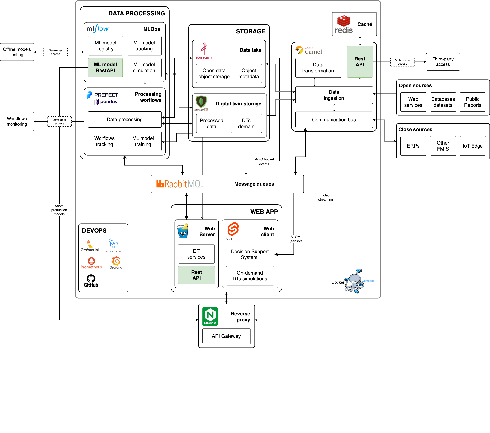

# Digital Twin for agrarian exploitations

## What is a Digital Twin?


## What is this project about?


## Architecture

The architecture of the project is the following:



## Deployment

### Local deployment

In order to execute the project locally, you need to have installed the following tools:

- [Docker](https://docs.docker.com/get-docker/)
- [Docker Compose](https://docs.docker.com/compose/install/)
- [Visual Studio Code](https://code.visualstudio.com/download) for the sake of simplicity

Actually it has been tested in MacOS, but it should work in Linux and Windows as well. It make use of the [Remote Containers](https://marketplace.visualstudio.com/items?itemName=ms-vscode-remote.remote-containers) extension for Visual Studio Code, so you need to install it as well. The Docker option `Dev Environments (BETA)` is used to create the development environment. It takes the `docker-compose.yml` file and creates the containers. The `devcontainer.json` file is used to configure the development environment. If you want to develop inside a container, through the dev environment, you have an option to attach to an existing container and it uses de `devcontainer` option in Visual Studio code. In this case, no deppendencies need to be installed globally, but in the container.

To execute it if not using the dev environment, you need to execute the following command:

```bash
docker-compose up --build -p digital-twin-local
```

#### golang cli

This applies to all types of deployments. A golang bash cli is provided to execute some actions. To execute it you need to execute the following command:

```bash
./project-cli.sh
```

### Development deployment

To execute it you need to execute the following command:

```bash
docker-compose -f docker-compose.dev.yml -p digital-twin-dev --env-file .env.dev up --build
```

### Production deployment

To execute it you need to execute the following command:

```bash
docker-compose -f docker-compose.prod.yml -p digital-twin-prod --env-file .env.prod up --build
```

## Secrets

Secrets, for the moment, are stored in its respective env file (`.env`, `.env.dev`, `.env.prod`), but it is not a good practice. It is better to store them in a secret manager, like [Vault](https://www.vaultproject.io/). In the future, it will be implemented. This files are injected to its respective container through the `docker-compose.yml` files.

## Future work (or not)

- <https://blog.min.io/lakehouse-architecture-iceberg-minio/>
- <https://www.arecadata.com/high-performance-open-source-data-lakehouse-at-home/>
